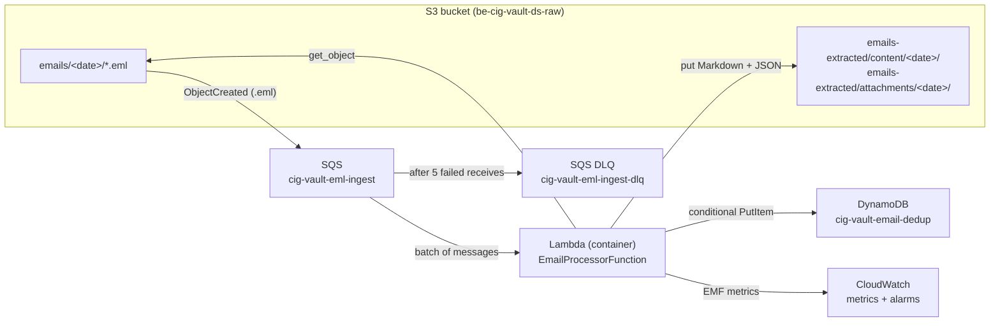
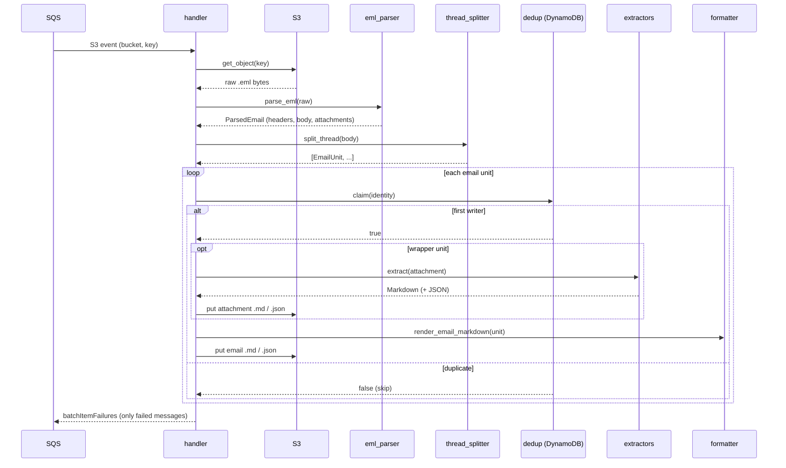

# Architecture

How the email pipeline is put together and why. This page covers the core concepts,
the AWS topology, and the end-to-end flow of a single `.eml` file. For a module-by-module
reference see [components.md](components.md); for the reasoning behind each choice see
[design-decisions.md](design-decisions.md).

## What the pipeline does

The pipeline turns Outlook emails into clean, searchable text. Each `.eml` file that
lands in S3 is parsed, broken into its individual emails, de-duplicated, and written back
to S3 as **Markdown** (for reading and RAG) plus a **JSON** sidecar (for metadata).
Attachments (PDF, PowerPoint, Excel, Word, text) are extracted to Markdown too.

It runs as a single **AWS Lambda** container, triggered by new files in S3 and fed
through an **SQS** queue so failures can retry safely.

## Core concepts

| Concept | Meaning |
|---------|---------|
| **`.eml` / MIME** | The raw email file format. It holds headers, one or more body parts (plain text and/or HTML), and attachment parts. |
| **Direct vs. forward** | A *direct* email is a single message. A *forward* wraps one or more older, quoted emails inside its body. |
| **Thread splitting** | Breaking a forwarded body back into the separate emails it contains. |
| **Email unit** | One individual email after splitting. Unit 0 is the *wrapper* (the real message envelope); later units are quoted emails whose headers came from the body text. |
| **Dedup identity** | A stable ID for an email, so the same message seen across many forwards is only written once. It is the `Message-ID` when present, otherwise a SHA-256 hash of the normalized From + Date + Subject + body. |
| **Attachment vs. inline** | Only real attachments (`Content-Disposition: attachment`) are extracted. Inline images (signature logos, `image001.png`) are skipped. |
| **HTML-only fallback** | Many Outlook emails have no plain-text body. When that happens the HTML body is converted to Markdown so output is never empty. |
| **Idempotency** | Re-processing the same file produces no duplicate output. A DynamoDB conditional write enforces this atomically. |
| **Date partitioning** | Outputs mirror the input's `<date>` folder, so `emails/2026-07-27/…` maps to `emails-extracted/content/2026-07-27/…`. |

## System architecture

The whole system is event-driven and serverless. A new file in S3 raises an event that is
queued in SQS; the Lambda consumes the queue, processes the file, and writes results back
to the same bucket. DynamoDB is the shared memory that makes de-duplication safe across
parallel invocations.



**Why this shape**

- **S3 → SQS → Lambda** (not S3 → Lambda directly) gives retries and a dead-letter queue,
  so a single malformed email cannot silently vanish or block the pipeline.
- **DynamoDB** holds the dedup registry. A conditional write is atomic, so many Lambdas can
  run at once without a coordination bottleneck.
- **One bucket** holds both input and output under different prefixes, keeping IAM simple.

## End-to-end flow

For every `.eml` object, the handler runs the same six stages. The wrapper unit is the only
one that "owns" the attachments, so attachments are written once even when the same email
recurs in later forwards.



The stages:

1. **Download** — read the raw `.eml` bytes from S3.
2. **Parse** — decode MIME into headers, the best body, and real attachments.
3. **Body selection** — prefer non-empty `text/plain`; otherwise convert HTML to Markdown.
4. **Thread split** — produce one or more email units from the body.
5. **Dedup** — claim each unit's identity; skip if already processed.
6. **Write** — render Markdown + JSON and put them to the date-partitioned output prefix.

## Idempotency and de-duplication

The same email appears many times across forwards, so the pipeline must never write it
twice. Each email unit is reduced to a stable **identity**:

- Use the RFC 5322 `Message-ID` if the unit has one (only the wrapper usually does).
- Otherwise compute `sha256:` over the normalized `From + Date + Subject + body-prefix`
  (first 2000 chars, whitespace-collapsed, lowercased).

Before writing, the handler calls `DedupRegistry.claim(identity)`, which does a DynamoDB
`PutItem` with `ConditionExpression="attribute_not_exists(pk)"`:

- **Condition succeeds** → this invocation is the first writer → process and write outputs.
- **Condition fails** (`ConditionalCheckFailedException`) → already seen → skip.

Because the check and the write are one atomic operation, concurrent Lambdas stay correct
without any locking or single-threading.

## Output layout

Outputs mirror the input's date folder so the results are easy to browse and crawl.

```
emails-extracted/
  content/<date>/<subject-slug>__<hash8>.md      # one file per email unit
  content/<date>/<subject-slug>__<hash8>.json     # metadata sidecar
  attachments/<date>/<eml-stem>__<file-slug>.md   # one file per attachment
  attachments/<date>/<eml-stem>__<file-slug>.json # metadata (+ tabular data for xlsx)
```

- `<date>` is parsed from the source key (`YYYY-MM-DD`), or `undated` if none is found.
- `<hash8>` is the first 8 hex chars of the identity hash, keeping filenames unique.
- Slugs are lowercase and URL-safe; opaque Outlook EntryID filenames never reach a key.
- The email JSON lists its attachment references; xlsx attachments also embed row data.

## Error handling and resilience

- Each SQS record is processed inside its own `try/except`. A failure logs the exception
  and adds that message to `batchItemFailures`, so **only the failing message retries**.
- After the configured retries, SQS moves the message to the **dead-letter queue** instead
  of blocking the pipeline.
- Oversized attachments (> `MAX_ATTACHMENT_BYTES`, default 25 MiB) are skipped and counted,
  a basic guard against zip-bomb / oversized files.
- Unsupported or corrupt attachments return `None` from the extractor and are skipped and
  logged rather than failing the whole email.

## Observability

- The handler emits **CloudWatch EMF metrics** as one structured log line per invocation:
  `EmailsProcessed`, `IndividualEmailsWritten`, `DedupSkips`, `AttachmentsExtracted`,
  `ExtractionFailures`.
- Two **CloudWatch alarms** are defined in the stack: DLQ depth `> 0` and Lambda errors
  `> 0` (both over a 5-minute window).

## Security posture

- **Least-privilege IAM**: the Lambda can read only `emails/*`, write only `emails-extracted/*`,
  read/write the single dedup table, and consume the ingest queue — nothing broader.
- **Scoped S3 → SQS policy**: the queue only accepts messages from the source bucket in the
  same account.
- **Deferred hardening** (see [design-decisions.md](design-decisions.md) D25): SSE-KMS on
  outputs, parser sandboxing / time budgets, and optional in-VPC execution are documented
  for a later pass.

## Configuration

The same container image runs everywhere; behavior is set by environment variables
(resolved in [config.py](../src/email_pipeline/config.py)) and matched by CDK context.

| Variable | Default | Meaning |
|----------|---------|---------|
| `SOURCE_BUCKET` | `be-cig-vault-ds-raw` | Bucket holding input and output objects |
| `INPUT_PREFIX` | `emails/` | Prefix scanned for `.eml` inputs |
| `OUTPUT_PREFIX` | `emails-extracted/` | Prefix for generated Markdown/JSON |
| `DEDUP_TABLE` | `cig-vault-email-dedup` | DynamoDB dedup table name |
| `METRICS_NAMESPACE` | `CigVault/EmailPipeline` | CloudWatch metrics namespace |
| `MAX_ATTACHMENT_BYTES` | `26214400` (25 MiB) | Skip attachments larger than this |

CDK context knobs (`-c key=value`) also cover Lambda memory, timeout, SQS batch size, and
batching window. See [stack.py](../infra/cdk/stack.py).

## Related documents

- [components.md](components.md) — module-by-module reference.
- [design-decisions.md](design-decisions.md) — the D1–D26 decision record.
- [decision-confirmations.md](decision-confirmations.md) — options offered vs. selected.
- [verification-checklist.md](verification-checklist.md) — end-to-end test checklist.
