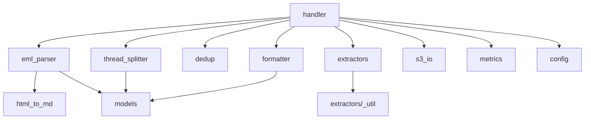

# Components

A module-by-module guide to the pipeline. Each entry lists what the module does, its key
functions, and what it depends on. Modules live under
[src/email_pipeline/](../src/email_pipeline/). For the big picture see
[architecture.md](architecture.md).

The code is grouped into six areas: **orchestration**, **parsing**, **de-duplication**,
**extraction**, **output**, and **observability**, plus the **infrastructure** that
deploys it.

## Orchestration

### handler.py
The Lambda entry point. `handler(event, context)` iterates the SQS records, and for each
referenced S3 object calls `process_object`, which downloads the `.eml`, parses it, splits
the thread, and writes outputs for each unique email unit. Failures are isolated per SQS
message and returned as `batchItemFailures` so only the failing message retries.

- **Key functions:** `handler`, `process_object`, `_process_attachments`, `_apply_envelope`,
  `_iter_object_keys` (unwraps the S3 event from the SQS body, handles `s3:TestEvent`),
  `_date_from_key`, `_short_hash`, `_json_key`.
- **Depends on:** every other module in the package.

### config.py
Resolves runtime configuration from environment variables into a frozen `Config`
dataclass, so the same image runs across environments without code changes.

- **Key items:** `Config` (with `content_prefix` / `attachments_prefix` properties),
  `load_config()`. Defaults cover the bucket, input/output prefixes, dedup table, metrics
  namespace, and max attachment size.
- **Depends on:** stdlib only.

### models.py
Shared dataclasses passed between stages, kept in one module to avoid circular imports.

- **Types:** `Attachment` (filename, content_type, data), `ParsedEmail` (envelope headers,
  best body, attachments), `EmailUnit` (one individual email; `order`, `is_wrapper`,
  `headers`, `body`, `is_external`, plus `from_`/`to`/`cc`/`subject`/`date` properties).
- **Depends on:** stdlib only.

## Parsing

### eml_parser.py
Parses raw `.eml` bytes into a `ParsedEmail` using the stdlib `email` package with
`policy.default`, so transfer encodings and charsets are decoded transparently.

- **Behavior:** selects the best body (non-empty `text/plain`, else HTML → Markdown); keeps
  only parts with `Content-Disposition: attachment` (inline images are skipped).
- **Key functions:** `parse_eml`, `_extract_body`, `_extract_attachments`, `_clean_header`.
- **Depends on:** `html_to_md`, `models`.

### html_to_md.py
Converts an HTML email body to Markdown for HTML-only emails.

- **Behavior:** strips `script`/`style`/`head`/`meta`/`title`, drops images, runs
  markdownify (ATX headings), and collapses runs of blank lines.
- **Key function:** `html_to_markdown`.
- **Depends on:** BeautifulSoup4, markdownify.

### thread_splitter.py
Splits an email body into ordered `EmailUnit` objects. A direct email yields one unit; a
forward yields the wrapper (dropped if empty) plus each quoted email.

- **Behavior:** finds boundaries at Outlook divider lines (`_____`) and quoted header blocks
  (a `From:` line followed within 5 lines by `Sent:`/`Date:`). Parses quoted headers
  (normalizing `Sent:` → `date`), preserves `EXTERNAL EMAIL` banners as `is_external`, and
  renumbers units so `order` is contiguous. A quoted block with no body is dropped even when
  it has headers — this discards header-only forward hops that nested Outlook forwards stack
  up (attachments are owned by the wrapper, not by quoted units).
- **Key functions:** `split_thread`, `_find_boundaries`, `_parse_header_block`,
  `_strip_segment`.
- **Depends on:** `models`. This is the highest-risk module; it is covered heavily by tests.

## De-duplication

### dedup.py
Computes an email's identity and enforces first-writer-wins idempotency in DynamoDB.

- **Behavior:** `compute_identity` returns the `Message-ID` if present, otherwise
  `sha256:` over normalized From + Date + Subject + first 2000 body chars.
  `DedupRegistry.claim` does a conditional `PutItem` (`attribute_not_exists(pk)`) and
  returns `True` for a new email or `False` if it already exists.
- **Key items:** `compute_identity`, `DedupRegistry`, `_normalize_body`.
- **Depends on:** boto3 (DynamoDB resource, injectable for tests).

## Extraction

### extractors/__init__.py
Dispatches attachment extraction by file extension and degrades gracefully.

- **Behavior:** `extract(filename, data)` routes `.pdf/.pptx/.xlsx/.docx/.txt/.csv/.log/.md`
  to the right extractor; unsupported types return `None`, and any extractor exception is
  logged and swallowed (returns `None`).
- **Depends on:** the per-format extractor modules and `_util`.

### extractors/_util.py
Shared helpers for extractors: the `ExtractionResult` dataclass (`markdown` +
optional `json_data`) and `rows_to_markdown_table`, which renders 2-D rows as a
GitHub-flavored Markdown table (escaping `|`, padding ragged rows).

### extractors/pdf.py
Extracts text and tables per page via pdfplumber, adding a `## Page N` heading for each
page and rendering tables as Markdown. **Key function:** `extract`.

### extractors/pptx.py
Extracts slide text, shapes, and speaker notes via python-pptx, with a `## Slide N`
heading per slide. **Key function:** `extract`.

### extractors/xlsx.py
Extracts each worksheet via openpyxl (read-only, values only) into both a Markdown table
and structured JSON (`{"sheets": [{"sheet", "rows"}, …]}`) for downstream tabular use.
Empty rows are trimmed. **Key function:** `extract`.

### extractors/docx.py
Extracts paragraphs and tables from Word documents via python-docx, tables rendered as
Markdown. **Key function:** `extract`.

### extractors/text.py
Decodes plain text / CSV / log attachments with an encoding fallback chain
(utf-8 → utf-16 → iso-8859-1 → utf-8 with replacement). **Key function:** `extract`.

## Output

### formatter.py
Renders email units and attachments to Markdown + JSON and builds the output S3 keys.

- **Behavior:** `slugify` makes lowercase, URL-safe slugs (so opaque Outlook EntryIDs never
  reach a key). `content_key` / `attachment_key` build date-partitioned keys.
  `render_email_markdown` emits a heading, an `EXTERNAL EMAIL` marker when flagged, a
  header block, and the body. `render_attachment_markdown` emits a heading and the extracted
  content. `email_metadata` / `attachment_metadata` build the JSON sidecars.
- **Depends on:** `models`.

### s3_io.py
A thin boto3 wrapper scoped to one bucket. `get_object` reads bytes;
`put_markdown` and `put_json` write with the correct `Content-Type` (JSON is pretty-printed
with `ensure_ascii=False`). The client is injectable for tests.

## Observability

### metrics.py
Accumulates per-invocation counters and flushes them as one CloudWatch **EMF** log line, so
CloudWatch extracts metrics without an extra API call.

- **Counters:** `EmailsProcessed`, `IndividualEmailsWritten`, `DedupSkips`,
  `AttachmentsExtracted`, `ExtractionFailures`.
- **Key items:** `Metrics.increment`, `Metrics.flush`.

## Infrastructure

### infra/cdk/stack.py
Defines `EmailPipelineStack` — the full event-driven topology in AWS CDK:

- References the existing S3 bucket; creates the **DynamoDB** dedup table
  (pay-per-request, `RETAIN`), the **SQS** ingest queue and **DLQ** (max 5 receives), and
  the **container Lambda** (X86_64, configurable memory/timeout, env vars).
- Wires **S3 ObjectCreated (`.eml`) → SQS** with a scoped resource policy, grants
  least-privilege IAM, and adds **CloudWatch alarms** for DLQ depth and Lambda errors.
- All names, sizes, and batch settings are overridable via CDK context.

### infra/cdk/app.py
The CDK app entry point: instantiates `EmailPipelineStack` with the account/region from
context and synthesizes the template.

## Tests

The pytest suite under [tests/](../tests/) mirrors these modules — `test_handler`,
`test_eml_parser`, `test_thread_splitter`, `test_dedup`, `test_formatter`,
`test_html_to_md`, and `test_extractors` — using synthetic `.eml` fixtures and in-memory
document builders (no real PII). See [verification-checklist.md](verification-checklist.md).
