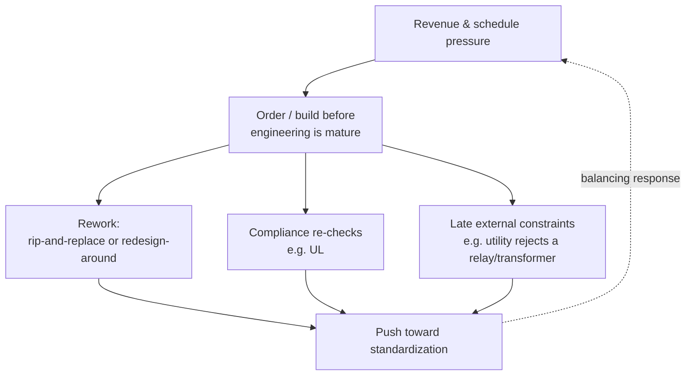

# CIG Installation Projects — Process & Domain Knowledge

---

## Table of Contents

1. [Purpose & Scope](#1-purpose--scope)
2. [What CIG Is](#2-what-cig-is)
3. [The End-to-End Lifecycle (Gate 0 → Gate 6)](#3-the-end-to-end-lifecycle-gate-0--gate-6)
4. [The Process Spine, Gate by Gate](#4-the-process-spine-gate-by-gate)
5. [Roles, People & the "Who to Ask" Network](#5-roles-people--the-who-to-ask-network)
6. [Key Documents & Artifacts](#6-key-documents--artifacts)
7. [Software & Systems Landscape](#7-software--systems-landscape)
8. [Glossary](#8-glossary)
9. [Recurring Pain Points & Failure Modes](#9-recurring-pain-points--failure-modes)
10. [Process Dynamics & Incentives](#10-process-dynamics--incentives)
11. [Standardization & Metrics](#11-standardization--metrics)
12. [External Dependencies & Constraints](#12-external-dependencies--constraints)

---

## 1. Purpose & Scope

A Bloom Energy project travels a long path — from the first sales conversation, through commercial contracting, engineering, procurement, manufacturing, physical construction, commissioning, and finally into service and eventual decommissioning. That full path is governed by a stage-gate process running Gate 0 through Gate 6.

**CIG owns the installation portion of that path.** Its center of gravity is **Gate 3 (contract executed) through Gate 6 (customer acceptance)** — taking a committed, signed project and physically delivering an operating system on the customer's site. The phases before Gate 3 (origination, solutioning, contracting) and after Gate 6 (long-term servicing and decommissioning) are owned by other groups — but CIG is not absent from them. CIG works alongside Sales before Gate 3 to help shape and close the deal, so the Gate 3 handover is frequently from CIG members who supported the sale to other CIG members who will execute it.

---

## 2. What CIG Is

**CIG — the Customer Installation Group — is responsible for taking a signed and committed project from agreement all the way to a running system on the customer's site.** In sequence, CIG's remit spans:

1. **Agreement** — receiving a project that has been sold and contracted.
2. **Drawings** — producing the engineering drawings that define what will be built.
3. **Permitting** — using those drawings to obtain permits and approvals.
4. **BOM creation and approvals** — defining and approving the bill of materials.
5. **Ordering and scheduling** — procuring materials and equipment and sequencing the work.
6. **Build and installation** — constructing and installing the system, typically through general contractors.
7. **Setup and commissioning** — bringing the installed system into operational readiness.

Along this path, CIG coordinates many **people**, produces and consumes many **documents** (drawings, plans, checklists, contracts), and works across many **software systems**. No single person holds end-to-end knowledge of all the moving parts, which is a defining challenge of the group's work.

**CIG** is intended to be focused on being the **installers** — executing the physical delivery of the system. CIG Project Managers (PMs) figure out whether required materials and equipment are available, whether they can be sourced in time, which suppliers to use, and how to drive every input to closure.

There is a separate dedicated **end-to-end project management** function which is the **overall program owner**, responsible for gathering and driving all the inputs across the whole lifecycle.

### CIG's scope varies by project

What CIG is responsible for delivering is not fixed — it depends on the contracted scope. Three named tiers exist:

- **Yard-only** — CIG delivers the systems and connects them up to a defined boundary (assume roughly a breaker at the edge of the yard), but is *not* responsible for interconnecting with the utility or the building, and *not* responsible for the site's overall ability to turn on. CIG's obligation is that *its piece* of the readiness is complete. This tier is becoming more common.
- **Consult-only** — CIG advises rather than executes the physical delivery.
- **Turnkey** — CIG is responsible for the full delivery through to a system that can be turned on.

These tiers are not rigid: CIG can sign up to execute more than a base tier (for example, yard-only *plus* handling the interconnection), but there is no separate named tier for such hybrids.

---

## 3. The End-to-End Lifecycle (Gate 0 → Gate 6)

The company runs a stage-gate process from the first sales call to decommissioning. It is organized into six **process bands**, a numbered set of **process stages**, and seven **gates** (Gate 0 through Gate 6) that mark formal transitions.

### Process bands

| # | Band | What happens |
|---|------|--------------|
| 1 | **Origination & pipeline management** | Finding and qualifying opportunities. |
| 2 | **Technical solutioning** | Shaping a technical solution and business case. |
| 3 | **Commercial contracting + ops planning** | Turning the solution into a firm proposal and executed contract. |
| 4 | **Pre-construction** | Detailed engineering, permitting, procurement, and manufacturing. |
| 5 | **Construction** | Physical installation, quality checks, and commissioning. |
| 6 | **Operation and maintenance** | Ongoing servicing and, eventually, decommissioning. |

### Process stages and gates

```mermaid
flowchart LR
    subgraph Origination & Solutioning
      G0([Gate 0<br/>Project qualification])
      S1[1. Connect & quantify]
      S2[2. Business case development]
      G1([Gate 1<br/>Stage 3 handover])
      S3[3. Stakeholder buy-in]
    end
    subgraph Commercial Contracting
      S4[4. Legal, concept engineering & commercial]
      G2([Gate 2<br/>Firm proposal / deal desk])
      S5[5. Contracting]
      G3([Gate 3<br/>Contract executed & handover])
    end
    subgraph Pre-construction
      S6a[6a. Detailed engineering & permissions]
      S6b[6b. Procurement]
      S6c[6c. Manufacturing]
      G4([Gate 4<br/>Clear to build & install start])
    end
    subgraph Construction
      S7a[7a. Installation & quality checks]
      S7b[7b. Commissioning & operational setup]
      G5([Gate 5<br/>Mechanical completion])
      G6([Gate 6<br/>Customer acceptance])
    end
    subgraph Operation
      S8[8. Servicing & decommissioning]
    end

    G0 --> S1 --> S2 --> G1 --> S3 --> S4 --> G2 --> S5 --> G3
    G3 --> S6a --> S6b --> S6c --> G4 --> S7a --> S7b --> G5 --> G6 --> S8
```



### The gates at a glance

| Gate | Name | Marks the transition to… |
|------|------|--------------------------|
| **Gate 0** | Project qualification | A qualified opportunity worth pursuing. |
| **Gate 1** | Stage 3 handover | A vetted deal handed to commercial operations to lead the proposal. |
| **Gate 2** | Firm proposal (FPAD) / deal desk | A firm, priced proposal ready for contracting. |
| **Gate 3** | Contract executed & handover to execution | A signed project handed to the execution team. **← Handover into execution (CIG is already involved earlier).** |
| **Gate 4** | Clear to build & install start | Confirmed readiness to begin physical installation. |
| **Gate 5** | Mechanical completion | A physically complete, connected site. |
| **Gate 6** | Customer acceptance | A system turned on and accepted by the customer. **← CIG's core work ends here.** |

Gates 0–2 are **pre-installation** (origination, solutioning, contracting) and are largely owned by sales, energy-transition, and commercial teams. CIG inherits the results of that work at Gate 3.

### How the stages are tracked (and aren't)

The stage model above comes from a single planning slide and does not map cleanly onto any system of record:

- Salesforce tracks contract/opportunity stages only **through Stage 6**. Stages 7 (installation & commissioning) and 8 (servicing & decommissioning) were defined for this slide to capture execution work and are **not tracked as stages in any system of record**.
- The sub-stages (6a, 6b, 6c, 7a, 7b) come from the same slide and are likewise not formally tracked.
- CIG effectively takes over execution at **Stage 6**, which it refers to as **development** — running from contract signing and technical handover through to **mobilization** (moving onto site to begin construction), the official end of development.

---

## 4. The Process Spine, Gate by Gate

This section walks each gate and stage in order. For CIG's core (Gate 3 onward) it details the headline **deliverable**, the **activities**, the **systems** where the work lives, and the **common failure mode** — the thing that most often breaks. For the pre-installation gates, it records the **owner, cadence, purpose, and participants** as defined in the governing stage-gate process.

### Gate 0 — Project qualification

- **Purpose:** Validate customer requirements and develop the initial budgetary proposal *(BPAD — expansion unconfirmed; understood as the early budgetary proposal & design document)*.
- **Owner:** Account executive.
- **Cadence:** Roughly twice weekly, 30–45 minutes.
- **Participants:** TSE *(expansion unconfirmed)*, Energy Transition, Application Engineering.

### Stages 1–2 — Connect & quantify → Business case development

The opportunity is connected and quantified and a business case is developed, carrying the project toward the Stage 3 handover.

### Gate 1 — Stage 3 handover

- **Purpose:** Fill in and review the **deal quality scorecard**; if approved, commercial operations leads the proposal and the development of the **MSA** *(Master Service Agreement)* and **system order**.
- **Owner:** Stage 3 Energy Transition and account executives.
- **Cadence:** Roughly twice weekly, 45 minutes.
- **Participants:** E2E project manager, install project manager, account executive, Energy Transition, Compliance, Commercial Operations, Application Engineering / CIG, Structured Finance, Sales, Contract Management / Legal (as needed), Operations.

> This is the first gate where the E2E project manager, the install project manager, and CIG appear together with the commercial and finance functions — the earliest point installation thinking enters the deal.

### Stages 3–5 — Stakeholder buy-in → Legal, concept engineering & commercial → Contracting

Stakeholder buy-in is secured, legal/concept-engineering and commercial terms are worked, a firm proposal is produced at **Gate 2 (Firm proposal / deal desk)**, and the contract is negotiated to execution.

### Gate 3 — Contract executed & handover to execution

This gate marks the **handover into the execution team**, not the literal start of CIG involvement — CIG is already engaged before this point, supporting Sales to close the deal. In practice the handover is often from CIG members who worked the deal to other CIG members who will execute it. Gate 3 is best understood as the transition from selling the project to executing it, and it opens the **development** phase (Stage 6): contract signing and technical handover through to mobilization.

- **Purpose:** Validate the firm proposal documents and hand them over to execution and pre-construction planning.
- **Owner:** E2E program manager or install project manager.
- **Cadence:** Weekly, ~30 minutes, plus a monthly full-portfolio review.
- **Participants:** Site design, Permitting, Utility gas/interconnect specialists, Civil and electrical engineers, Supply chain management, Partner procurement, Third-party gear procurement, CDE *(expansion unconfirmed)*, Services.
- **Headline deliverable:** A **technical handover packet** — together with the pricing package, the as-sold BOM (the **SE BOM** / project configuration), the offtake customer contract, basic project information, and — most importantly — a clear statement of **CIG's scope** of what it will design and install.
- **Systems where it lives:** Salesforce, individual inboxes, SharePoint, Egnyte — or, in practice, sometimes *nowhere* findable.
- **Common failure mode:** The truth is **scattered**; the packet's contents are hard to extract from email threads, and the current version of any given artifact may not be locatable. The single highest-value artifact is the **scope of design & install**, because everything downstream is checked against it.

### Stage 6a — Detailed engineering, permissions & other

- **Headline deliverables:** Engineering **drawings**, which then resolve into an **IFB set** (Issued For Bid — used to bid the work to a general contractor), an **IFC set** (Issued For Construction — used by the contractor to build), and a **permit set** (used to obtain permits and approvals). Drawings are the key product of this stage.
- **Activities:** Producing and revising drawings; obtaining permits and approvals; issuing bid and construction sets; beginning material ordering (whose key output is *receiving* the materials).
- **Systems where it lives:** Drawings originate in a drawing/CAD tool, are managed through **EPDM** (to which few people have access), and are then published to **Egnyte**, and sometimes to **Salesforce** or **Procore**. Materials are tracked in **Agile** today, moving to **Oracle Fusion** in the future.
- **Common failure mode:** The **"latest revision" is often unknowable**, and it is unclear *when* a drawing should be published to Egnyte, *when* it should be loaded into Procore, and *whether* it should be loaded as a plain document or as a managed drawing set. These publishing-timing questions are an open, unresolved part of the process.

### Stages 6b / 6c — Procurement & Manufacturing

- **Headline deliverable:** The **electrical equipment and product shipped to site**.
- **Activities:** Procurement (professional services, partners, materials, and third-party gear) and manufacturing of Bloom-produced equipment.
- **Systems where it lives:** Mostly the physical world; **Oracle** serves as the digital system of record.
- **Common failure mode:** **Timelines** — specifically, ordering or manufacturing something *before* enough engineering has been done to know precisely what is needed. (See [Process Dynamics](#10-process-dynamics--incentives) for why this happens.)

### Gate 4 — Clear to build & install start

- **Headline deliverable:** A **clear-to-build checklist**.
- **Systems where it lives:** Should live in Salesforce.
- **Common failure mode:** The checklist is **often simply not done** — not because it is hard, but because completing it is not prioritized.

### Stage 7a — Installation & quality checks

- **Headline deliverable:** An **installed system ready to operate**, with **CQG** (contractor quality guarantees) covering workmanship.
- **Common failure mode:** **Problems during construction are not currently well recorded** — a genuine data gap. When construction issues occur, the knowledge of what went wrong and how it was resolved is largely lost.

### Stage 7b — Commissioning & operational setup

- **Headline deliverable:** **Commissioning documents**. Commissioning (**Cx**) is owned by the **Service** organization.
- **Systems where it lives:** Likely **no dedicated commissioning system** exists.
- **Common failure mode:** Issues surface here from two upstream sources: **installation problems** and **part-quality problems**, the latter especially for Bloom-produced or Bloom-purchased parts.

### Gate 5 — Mechanical completion

- **Purpose:** Ensure mechanical completion, confirm the **"big 5"** utilities are connected — **HV, LV, water, gas, and telecom** — and hand over to the commissioning team.
- **Owner:** CIG install project manager.
- **Cadence:** Weekly, ~30 minutes, plus a monthly full-portfolio review.
- **Participants:** CIG install PM, E2E program manager, Field service technicians, Rmcc *(expansion unconfirmed)*, Construction.
- **Headline deliverable:** A **certification that the site is complete**. What "complete" means depends on the contracted scope — for a yard-only project it certifies that CIG's piece of the readiness is done, not that the site can be energized (utility interconnection and building tie-in sit outside that scope).
- **Common failure mode:** This gate **reflects everything upstream** — the site cannot be certified complete if anything earlier remains unresolved.

### Gate 6 — Customer acceptance

- **Headline deliverable:** The **systems turned on** and accepted by the customer.
- **Common failure mode:** Largely **external dependencies** — the customer not being ready, the utility not connecting quickly enough, or a financier not being in place. (See [External Dependencies](#12-external-dependencies--constraints).)

### Stage 8 — Servicing & decommissioning

After acceptance, the project passes into the **operation and maintenance** band — long-term servicing and eventual decommissioning — owned by the Service organization. This is outside CIG's installation mandate and is captured here only for lifecycle completeness.

---

## 5. Roles, People & the "Who to Ask" Network

A defining reality of CIG work is that **many answers live only in a human network** — the value is not just in *what* the answer is, but in *who to ask*. The people and functions below appear across the lifecycle.

### CIG and program management

- **CIG installers** — execute the physical delivery of the system (CIG's target future focus).
- **Install project manager (CIG install PM)** — owns installation execution; owner of the Gate 5 (mechanical completion) review.
- **End-to-end (E2E) project manager / program manager** — drives all inputs across the whole lifecycle (Chris Long's team); owner of the Gate 3 handover review.
- **Legacy SIG PMs and directors** — historically the "field marshals" who personally drove product, sourcing, and timing to closure.

### Internal functions (the go-to network)

- **Production** — the internal contact for product/manufacturing questions.
- **Supply chain & logistics** — the internal contact for sourcing, availability, and delivery questions.
- **Engineering** — civil and electrical engineers who produce the technical package and drawings.
- **Estimators** — build the bottoms-up price; map scope to cost.
- **Product team** — consulted on whether a solution uses standard architecture and standard gear.
- **Service** — owns commissioning and long-term servicing.
- **Site design & permitting** — site layout and permit acquisition.
- **Utility gas / interconnect specialists** — manage utility connection dependencies.
- **Field service technicians** — on-site service execution around commissioning and completion.

### Commercial, finance & compliance (mostly pre-Gate 3)

- **Account executives / Sales** — own the customer relationship and the deal through qualification.
- **Energy Transition (ET)** — a lead function through origination and the Stage 3 handover.
- **Application Engineering** — shapes the technical solution early.
- **Commercial Operations** — leads the proposal and the MSA / system order after Gate 1.
- **Structured Finance** — handles financing structure.
- **Contract Management / Legal** — handle contracting (as needed).
- **Compliance** and **Operations (Ops)** — supporting functions in the deal reviews.
- **CDE** *(expansion unconfirmed)* and **Rmcc** *(expansion unconfirmed)* — named participants in the Gate 3 and Gate 5 reviews respectively.

### External network

- **General contractors (GCs)** — bid on and build the installation from the IFC set.
- **Local subcontractors** — perform specialized work under the GCs. **Capacity must be understood at the subcontractor level across the whole portfolio** (see the subcontractor-overload pain point in [Section 9](#9-recurring-pain-points--failure-modes)).
- **Partner organizations** — each typically has a **designated representative** who is the person to ask; the network includes partner procurement and third-party gear procurement paths.
- **The offtake customer** — the party that signs the contract and accepts the system.
- **Utility** and **financier** — external parties whose readiness gates customer acceptance.

---

## 6. Key Documents & Artifacts

The artifacts below are the currency of the process. The ones most central to CIG are marked **(core)**.

### Commercial & handover

- **Deal quality scorecard** — reviewed at the Stage 3 handover (Gate 1) to decide whether to proceed.
- **BPAD** *(expansion unconfirmed)* — the early budgetary proposal developed around Gate 0.
- **Firm proposal documents / FPAD** — the firm, priced proposal finalized at Gate 2.
- **MSA (Master Service Agreement)** and **system order** — the contractual instruments developed after Gate 1.
- **Offtake customer contract (core)** — the executed contract with the customer; the ultimate reference for what was agreed.
- **Technical handover packet (core)** — the Gate 3 package handed to execution.
- **Pricing package (core)** — the agreed pricing detail.
- **As-sold BOM — "SE BOM" / project configuration (core)** — the bill of materials as sold to the customer.
- **Scope of design & install (core)** — the statement of what CIG is committed to design and install. **This is the single highest-value document**, because everything downstream is validated against it.

### Engineering & construction

- **Drawings (core)** — the primary engineering product; the basis for permits, bids, and construction.
- **IFB set (core)** — Issued For Bid; used to solicit bids from general contractors.
- **IFC set (core)** — Issued For Construction; used by the contractor to build.
- **Permit set (core)** — the drawing set used to obtain permits and approvals.
- **Bill of materials** — the materials list driving procurement (distinct from the as-sold SE BOM).
- **Material orders & receiving records** — procurement artifacts.
- **Clear-to-build checklist (core)** — the Gate 4 readiness checklist.

### Quality, commissioning & standards

- **CQG — contractor quality guarantees (core)** — guarantees on installation workmanship.
- **Commissioning documents (core)** — produced during commissioning; owned by Service.
- **POR for standard parts (Plan of Record)** — a forthcoming authoritative reference defining which parts count as "standard." Its arrival is significant: it becomes the yardstick against which any project's bill of materials can be classified as standard versus custom.

---

## 7. Software & Systems Landscape

Truth about a CIG project is spread across many systems, each owning a slice. Understanding *which* system holds *what* — and where the seams are — is essential.

| System | Role in the process | Notes / weak points |
|--------|--------------------|---------------------|
| **Salesforce** | Holds project data; intended home for the clear-to-build checklist; sometimes receives published drawings. | Also holds some people's inboxes and general files — part of why truth is scattered. |
| **Email inboxes** | Where much handover material actually circulates. | Documents are hard to extract from scattered email threads. |
| **SharePoint** | A possible store for project files. | One of several places truth *may* live. |
| **Egnyte** | A publishing destination for drawings. | *When* to publish here is an unresolved process question. |
| **EPDM** | Manages engineering drawings between the CAD tool and publication. | **Few people have access**, limiting visibility of the managed source. |
| **Drawing / CAD tool** | Where drawings originate. | — |
| **Procore** | Construction-management platform; can hold drawings either as plain documents or as managed drawing sets. | *When* to load, and *whether* as document vs. drawing set, is an unresolved process question. |
| **Agile** | Current system of record for materials. | Being migrated to Oracle Fusion. |
| **Oracle / Oracle Fusion** | Digital system of record for procurement and manufacturing; future home for materials. | Migration from Agile is planned and considered straightforward. |

The recurring theme across all of these: for any given artifact, **the current, authoritative version may live in any one of these systems — or nowhere findable.** (See [Section 9](#9-recurring-pain-points--failure-modes).)

---

## 8. Glossary

| Term | Definition |
|------|------------|
| **CIG** | Customer Installation Group — the group responsible for installing committed projects, from agreement through commissioning; increasingly focused on being the installers. |
| **SIG** | The predecessor project-management organization whose PMs and directors historically acted as end-to-end "field marshals." *(Expansion unconfirmed.)* |
| **E2E PM** | End-to-end project (or program) manager — owns and drives all inputs across the full lifecycle; associated with Chris Long's team. |
| **Gate 0–Gate 6** | The seven formal transition points of the company stage-gate process, from project qualification (0) to customer acceptance (6). |
| **Stage 6a / 6b / 6c / 7a / 7b** | Process sub-stages: 6a detailed engineering & permissions, 6b procurement, 6c manufacturing, 7a installation & quality checks, 7b commissioning & operational setup. Defined on a planning slide; not formally tracked in any system of record. |
| **Development** | CIG's term for the Stage 6 execution phase, running from contract signing and technical handover through to mobilization (the official end of development). |
| **BPAD** | Early budgetary proposal document developed around Gate 0. *(Expansion unconfirmed.)* |
| **FPAD** | Firm proposal document finalized at Gate 2 ("firm proposal / deal desk"). *(Expansion unconfirmed.)* |
| **Deal desk** | The Gate 2 forum/mechanism for finalizing a firm proposal. |
| **Deal quality scorecard** | The assessment reviewed at the Stage 3 handover (Gate 1) to decide whether to advance a deal. |
| **MSA** | Master Service Agreement — a contractual instrument developed after Gate 1. |
| **System
 order** | The order instrument developed alongside the MSA after Gate 1. |
| **Offtake customer** | The customer party that signs the contract and accepts the delivered system. |
| **Technical handover packet** | The Gate 3 package that hands a signed project into execution. |
| **SE BOM** | The as-sold bill of materials / project configuration — what was sold to the customer. |
| **Scope of design & install** | The definition of what CIG is committed to design and install; the reference everything downstream is checked against. |
| **Yard-only scope** | A scope tier where CIG delivers and connects systems up to a defined boundary (roughly a breaker at the edge of the yard) but is not responsible for utility interconnection, building tie-in, or the site's overall ability to turn on. Increasingly common. |
| **Consult-only scope** | A scope tier where CIG advises rather than executes the physical delivery. |
| **Turnkey scope** | A scope tier where CIG is responsible for full delivery through to a system that can be turned on. |
| **Adder** | An additional scope element added onto a base solution (e.g., a "platform adder"). |
| **Purpose category** | The reason a scope item exists, used to classify work: **primary power**, **microgrid**, **platform adder**, or **custom request**. |
| **Drawings** | The primary engineering product defining what will be built. |
| **IFB** | Issued For Bid — the drawing set used to solicit contractor bids. |
| **IFC** | Issued For Construction — the drawing set the contractor builds from. |
| **Permit set** | The drawing set used to obtain permits and approvals. |
| **Clear-to-build checklist** | The Gate 4 checklist confirming readiness to start installation. |
| **CQG** | Contractor Quality Guarantees — guarantees covering installation workmanship. |
| **Cx** | Commissioning — bringing the installed system to operational readiness; owned by Service. |
| **Mechanical completion** | Gate 5 — certification that the site is physically complete and the "big 5" are connected. |
| **Big 5** | The five site connections required for mechanical completion: **HV** (high voltage), **LV** (low voltage), **water**, **gas**, and **telecom**. |
| **Bottoms-up pricing** | A price built from detailed scope items, cost breakdowns, and adders. |
| **Top-down pricing** | A price arrived at from the contract/customer side, at a higher level than individual scope items. |
| **GC** | General contractor — bids on and builds the installation. |
| **Subcontractor** | A specialist working under a GC; a single local subcontractor can be shared across multiple GCs/projects. |
| **POR** | Plan of Record — a forthcoming authoritative reference for what counts as a "standard" part. |
| **Standard vs. custom** | Whether a project (or a part of it) uses standard gear/architecture versus custom-designed elements. |
| **TSE** | A technical role participating in the Gate 0 review. *(Expansion unconfirmed.)* |
| **ET** | Energy Transition — a lead function through origination and the Stage 3 handover. |
| **Commercial Operations (comm ops)** | The function that leads the proposal and the MSA / system order after Gate 1. |
| **Structured Finance** | The function handling financing structure. |
| **CDE** | A named participant in the Gate 3 review. *(Expansion unconfirmed.)* |
| **Rmcc** | A named participant in the Gate 5 review. *(Expansion unconfirmed.)* |
| **Field service technicians** | On-site personnel involved around commissioning and mechanical completion. |

---

## 9. Recurring Pain Points & Failure Modes

These are the domain's chronic weak points — the issues that recur across projects regardless of the specific site.

1. **Scope change and change management (the largest single driver).** Scope routinely changes after handover, and CIG's ability to manage those changes is the dominant pain point: the vast majority of budget and schedule changes trace back to scope changes. The changes themselves are visible; what is not well captured is the layer beneath them — the root causes that generate them, which include:
   - **Solutions not finalized at contract signature.** The technical solution, the Bloom Energy products, the sourcing of energy servers (often driven by financing needs), and the sizing of the site can all still be open when the contract is signed.
   - **Insufficient due diligence.**
   - **Breakdowns in information handoffs** — for example, completed due diligence or engineering not being factored into the final contract.
   - **Immature engineering at sell time**, leaving scope to firm up only after execution begins.
   - **Customer-driven changes** and **utility / AHJ rulings** (e.g., a relay or transformer being disallowed).
   - **Standardization gaps** (see pain point 6 below).

2. **No single source of truth (the central wound).** For any artifact, the current version may be in Salesforce, an inbox, SharePoint, Egnyte, EPDM, Agile/Oracle — or nowhere findable. There is no one place where the current version of a project's truth *provably* lives.

3. **Scope is not documented at item level.** The best scope artifact available today is a detailed drawing set. Price is tied to **categories of work** ("electrical = $X"), not to individual **scope items**. As a result there is no clean line from a specific physical item to its price and labor.

4. **Priced scope ≠ contract ≠ what the customer thought they bought.** This mismatch recurs repeatedly. What the estimator priced, what ended up in the contract, and what the customer believed they were buying routinely diverge — and there is often no plain-language scope statement to reconcile them against.

5. **Granularity loss.** Even when an estimator maps work item-by-item (e.g., the conductor from a specific server to a specific transformer), that detail collapses into **larger buckets** ("conductors") as it moves downstream. The per-item link between scope, price, and labor is lost.

6. **"Standard" is undefined.** There is no current registry or definition of what counts as a standard part, so standard-vs-custom cannot be measured — not even retroactively across past projects. (The forthcoming POR is expected to close this gap.)

7. **Premature procurement and build.** Materials and equipment are frequently ordered or manufactured *before* engineering is mature enough to know exactly what is needed. This is an incentive-driven behavior, not ignorance (see [Section 10](#10-process-dynamics--incentives)).

8. **Construction problems are not recorded.** When issues arise during construction, they are not systematically captured — a real data gap that prevents learning across projects.

9. **The clear-to-build checklist is often not completed.** The Gate 4 checklist is frequently deprioritized and left unfinished.

10. **Hidden subcontractor overload.** Assigning multiple general contractors to run projects in parallel can still overload a single **shared local subcontractor**, because capacity is not tracked at the subcontractor level across the whole portfolio.

11. **No dedicated commissioning system, and part-quality issues surface late.** Commissioning problems trace back to installation issues and to part-quality issues (especially for Bloom-produced or Bloom-purchased parts), but there is likely no dedicated system capturing them.

> **The underlying pattern.** Scope change is the top-line symptom, and several of the pains beneath it — scope mismatch, price-vs-contract gaps, the "is it standard?" question, and granularity loss — are facets of **one missing thing: a documented, item-level scope** that is locked down before contract signature. Where scope is defined only as categories of work and left open at signing, the downstream churn is almost inevitable.

---

## 10. Process Dynamics & Incentives

Some failure modes are not accidents; they are the predictable result of incentives. The most important dynamic is the **premature-build loop**.



**How the loop runs:**

- **Driver — revenue and schedule pressure.** There is strong pressure to ship early.
  - **Purchased gear** is shipped early to **compress the schedule** and ensure the project can be installed and operational on time.
  - **Bloom-produced gear** is shipped **even earlier**, to **pull revenue forward** — recognizing revenue as soon as possible.
- **Action — order or build before engineering is mature.** Because of that pressure, procurement and manufacturing get ahead of the engineering that would tell them exactly what is needed.
- **Consequence — rework.** When engineering catches up (or reality intervenes), the early bet often has to be undone:
  - **Brute-force rework** — remove the wrong equipment and order a replacement.
  - **Redesign-around** — modify everything else to accommodate what was already built or bought.
  - **Compliance re-checks** — for example, re-verifying UL compliance after a change.
  - **Late external constraints** — for example, a utility ruling that a particular relay or transformer cannot be used, forcing a rework.
- **Corrective response — standardization.** Rework does *not* make the organization ship earlier; instead it pushes toward **standardization**, so that early ordering stops being a gamble. Standard gear implies low engineering variance, which makes pre-ordering safer.

**The strategic tension.** The business is committing to **hundreds of megawatts of standard gear** even though, in most cases so far, it has *not* actually sold and shipped a standard configuration. Betting heavily on standardization while rarely shipping a standard is the central tension the standardization push must navigate.

---

## 11. Standardization & Metrics

Standardization is both the corrective response to rework and a strategic bet. Making that bet visible requires measurement — which today is blocked by the fact that "standard" is undefined.

**Metrics identified as important:**

- **Percentage of projects that are standard** — how often standard configurations are actually delivered.
- **Standard-parts usage** — how often standard parts are used, tracked as a **year-over-year KPI** (last year → this year → target) to demonstrate improvement over time.
- **Per-deviation rework cost** *(implied)* — the cost attributable to each departure from standard, which becomes measurable once a definition of "standard" exists.

**The enabler — the POR for standard parts.** None of these metrics can be computed today because there is no definition or registry of what is standard; even a retrospective review of last year's projects could not reliably classify which parts were standard. The forthcoming **Plan of Record (POR) for standard parts** is the enabler: once it exists, any project's bill of materials can be classified against it, making standard-fit measurable.

**Why it matters.** With standard-vs-custom made measurable, the standardization bet can be steered by data — for example, recognizing that a project is *70% standard / 30% custom, and that the custom 30% is exactly where rework tends to land.*

---

## 12. External Dependencies & Constraints

CIG can execute flawlessly and still be blocked by factors outside its control. These external dependencies concentrate at the end of the process (Gate 6) but should be anticipated throughout.

- **Customer readiness.** The customer must be able to meet their own obligations and be ready to receive and accept the system. Customer unreadiness is a common blocker at acceptance.
- **Utility connection / interconnection.** The utility must connect the site (and the "big 5" utilities must be in place). Slow utility timelines can hold up acceptance, and utility rulings can force late engineering changes (e.g., disallowing a particular relay or transformer).
- **Financier.** A financier must be in place for the project to complete.
- **Jurisdiction & permitting.** Local jurisdictions vary; there are jurisdiction-specific pitfalls to avoid, and prior experience in a jurisdiction is valuable knowledge.
- **Regional & contractor experience.** Whether the company has worked in a region before, and whether a given contractor or subcontractor has done comparable projects (and at comparable scale), materially affects risk.
- **Product availability.** Whether a suitable product exists and can be sourced in time for the specific project.

**Questions this domain repeatedly asks about external readiness:**

- Is our schedule reasonable, and are we covering all requirements?
- Have we worked in this jurisdiction and this region before?
- Will the customer be able to meet their obligations?
- Do we have product availability for this project — and for all the projects in the current portfolio, not just this one?
- Have we used this contractor before, and do they (and their subcontractors) have experience with projects like this at this scale?
```
