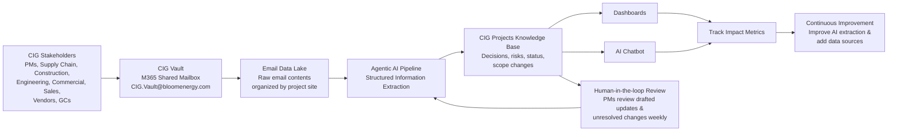

# CIG Project Intelligence — Agentic Project Tracking

An AI-automation initiative for Bloom Energy's Customer Installation Group (CIG) that turns scattered project emails into a structured, searchable knowledge base of project status, risks, decisions, and scope changes.

---

## Problem Statement

- Customer installation projects require coordination across multiple **internal teams** — sales, commercial, supply chain, construction, and engineering — and **external stakeholders** including customers, vendors, and general contractors.
- Critical discussions about **project status, risks, scope changes, and decisions** are largely conducted through long, unstructured email threads.
- There is no centralized, structured view of what is happening on each project, so knowledge stays trapped in inboxes.

This project centralizes CIG email data using **agentic AI** into a knowledge base to improve project tracking and visibility.

---

## Objectives

- **Ingest emails** — Copy email contents to files in a data lake.
- **Extract updates** — AI identifies project updates by reasoning over processed email content.
- **Build knowledge base** — Store extracted information in structured form.
- **PM reviews changes** — The knowledge base is updated after a PM reviews the AI-drafted changes.

---

## Solution

An agentic AI pipeline that flows from raw email to reviewed, structured project intelligence:

**Key components**

- **CIG Vault** — An M365 shared mailbox (`CIG.Vault@bloomenergy.com`) where stakeholders forward project email.
- **Email Data Lake** — All raw email contents from the vault inbox, organized by project site.
- **Agentic AI Pipeline** — Performs structured information extraction over the email content.
- **CIG Projects Knowledge Base** — Structured project updates: decisions, risks, status, and scope changes.
- **Human-in-the-loop Review** — PMs review drafted updates and unresolved changes weekly before they are committed.
- **Surfacing layer** — Dashboards and an AI chatbot expose the knowledge base to users.
- **Impact metrics & continuous improvement** — Track completeness, extraction accuracy, efficiency improvement, and adoption to keep improving the pipeline.

**Technology stack**

Outlook · AWS S3 · AWS Lambda · AWS Bedrock · Anthropic Claude · OpenAI GPT

---

## Impact

- **Improved visibility** — Status, risks, and decisions in one place.
- **Efficient project tracking** — Project updates captured automatically.
- **Single source of truth** — A centralized, searchable knowledge base of CIG projects.
- **Less manual effort** — AI drafts updates and PMs review.

Downstream benefits:

- **Earlier risk detection** — Surfaces at-risk projects before costly slips.
- **Fewer missed updates** — The system captures changes automatically.
- **Time saved** — PMs spend less time compiling status and more time on delivery.

---

## Next Steps

- **Pilot with CIG PMs** — Validate on a few live projects.
- **Dashboards and chatbot** — Build visualizations of real-time status and conversational Q&A.
- **Expand data sources** — Add instant messaging, meeting transcripts, and documents.
- **Measure impact** — Track time saved, accuracy, completeness, and adoption.
- **Improve AI extraction** — Increase extraction performance and include additional data sources.

---